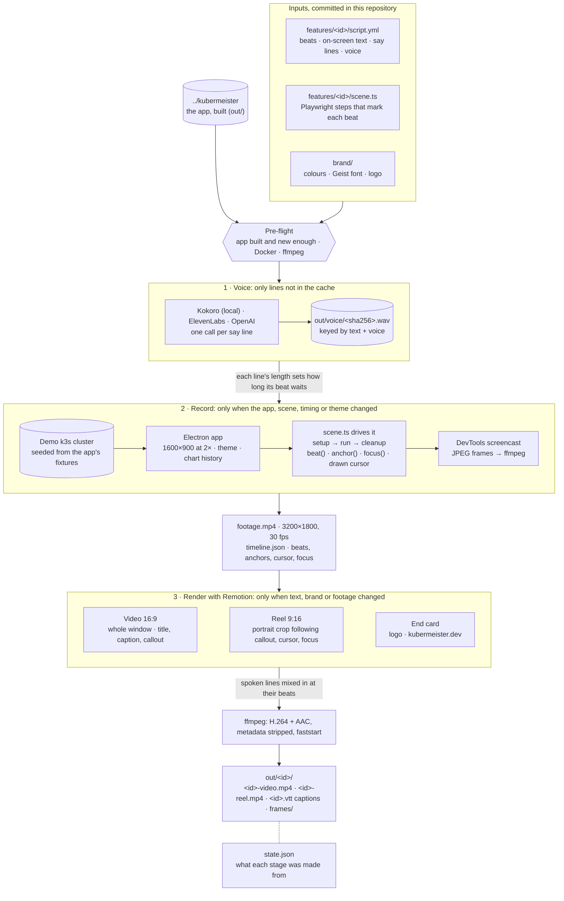

# kubermeister/screencasts

Promo videos of [Kubermeister](https://github.com/kubermeister/kubermeister) features, generated from
committed text files. Per feature, `script.yml` holds the beats, the text shown on screen and the
voiceover; `scene.ts` drives the app through those beats with Playwright. One command records the
app, synthesizes the voice and renders a 16:9 video, a 9:16 reel and WebVTT captions.

Videos are generated locally only. Nobody edits a video by hand, and nothing in `out/` is committed.

## How a video is made

`npm run video -- <id>` runs three stages in order (voice, record, render), each only when what it is
made from has changed since the last run.



1. **Pre-flight** checks the app checkout is built from its current sources and is at least the
   script's `since`, that Docker is running and that `ffmpeg` is on `PATH`.
2. **Voice** synthesizes each `say` line that is not cached yet. A line's length decides how long
   its beat waits, so a spoken line always finishes before the scene moves on.
3. **Record** films the real app against a seeded demo cluster. The scene drives it with Playwright;
   the renderer is captured over the DevTools protocol (a covered window still records), and every
   beat, anchor box, cursor move and focus is written to `timeline.json` with its time.
4. **Render** draws both formats with Remotion from the footage and the timeline: the text over
   the 16:9 video, and a portrait crop that follows what matters for the 9:16 reel. The spoken
   lines are mixed in at their beats, and the WebVTT captions are written alongside.
5. **`state.json`** stores a hash of what each stage was made from. The next run skips every stage
   whose inputs are unchanged (see [What reruns](#what-reruns)).

## Environment

- macOS (Apple silicon, Retina), Docker Desktop running, Node 24 (`.nvmrc`), npm ≥ 11.19, `ffmpeg`
  on `PATH`. `helm` on `PATH` is optional: without it the Helm screens have no release.
- The app checked out next to this repository and built:

  ```
  ~/Projects/Kubermeister/
    kubermeister/      # the app (github.com/kubermeister/kubermeister): run `npm run build` there
    screencasts/       # this repository
  ```

  Set `KUBERMEISTER_APP` to an absolute path to use a checkout somewhere else. Whatever the app
  checkout is on (a branch, `main`, a tag) is what gets filmed.

## Commands

```sh
npm run video -- <id>                        # record → voice → render, only what changed
npm run video -- <id> --format video|reel    # one format only
npm run video -- <id> --only record|voice|render
npm run video -- <id> --fresh                # ignore every cache
npm run video -- <id> --frames               # also write out/<id>/frames/NN-<beat>.png
npm run video -- <id> --open                 # open the outputs when done
npm run video -- <id> --theme light          # override the script's theme for this run
npm run video -- --all                       # every folder in features/, overview/, hero/
npm run new -- <id>                          # scaffold features/<id>/ from a template
npm run cluster -- up|down|status            # manage the demo cluster explicitly
```

Exit codes: 0 success, 1 failure (the message names the feature and the stage), 2 usage error.

Before recording, the CLI checks that the app checkout exists and is built from its current sources,
that its version is at least the script's `since`, that Docker is reachable and that `ffmpeg` is on
`PATH`. Each failed check prints the fix.

The demo cluster (`km-screencasts-cluster`, a k3s container seeded from the app's
`tests/demo/fixtures/`) is kept between runs. `KM_SCREENCASTS_FRESH=1` or `npm run cluster -- down`
removes it.

### What reruns

`out/<id>/state.json` remembers what each stage was made from. Without `--only` or `--fresh`, only
the stages whose inputs changed run again:

| Input changed                                                            | Redone                         |
| ------------------------------------------------------------------------ | ------------------------------ |
| The app's built `out/`                                                   | record, render                 |
| `scene.ts`, beat ids or holds, voice durations, theme, `src/harness/`    | record, render                 |
| A beat's `say` or the voice settings                                     | that line, then record, render |
| Any other part of `script.yml`, `brand/`, `src/render/`, `src/remotion/` | render                         |

If nothing changed, the CLI prints `<id> is up to date`.

### Rendering

Rendering uses Remotion with a Chrome Headless Shell. The CLI takes, in order:

1. `KM_SCREENCASTS_BROWSER`, when set: the path of any recent `chrome-headless-shell`.
2. The newest headless shell Playwright has installed (in `PLAYWRIGHT_BROWSERS_PATH`, or
   Playwright's default cache). Install one with `npx playwright install chromium-headless-shell`.
3. Otherwise, Remotion downloads its own on the first render. Its download host is not reachable
   from every network; if a first render hangs on "Downloading Chrome Headless Shell", install
   Playwright's as in 2.

### Voice

Voiceover is optional per feature. Kokoro runs locally and is the default; its model is downloaded
on first use. OpenAI (`OPENAI_API_KEY`) and ElevenLabs (`ELEVENLABS_API_KEY`) read their keys from
the environment or from `.env`.

### Configuration

Copy `.env.example` to `.env` and fill in what you need: API keys, the app's path, the render
browser. `.env` is git-ignored and loaded by every `npm run` command; a variable already set in
the shell wins over it.

## Outputs

```
out/
  voice/<sha256>.wav                 # shared voice cache, with <sha256>.json { durationMs }
  <id>/
    <id>-video.mp4                   # 1920×1080, 30 fps
    <id>-reel.mp4                    # 1080×1920, 30 fps
    <id>.vtt                         # WebVTT
    frames/NN-<beat>.png             # with --frames: the frame 600 ms into each beat
    footage.mp4                      # the raw recording (3200×1800, 30 fps)
    timeline.json                    # beats, anchors and cursor, the contract with the renderer
    state.json                       # cache keys
```

Both formats are H.264, `yuv420p`, 30 fps constant, CRF 18, `+faststart`, AAC 160 kb/s when there is
voice and no audio track otherwise, metadata stripped.

## Development

```sh
npm ci
npm run lint && npm run typecheck && npm run format:check && npm test
```

See `AGENTS.md` for the conventions and `PLAN.md` for the design.

Rendering uses [Remotion](https://www.remotion.dev) under its free license, which covers individuals
and companies of up to three employees.
